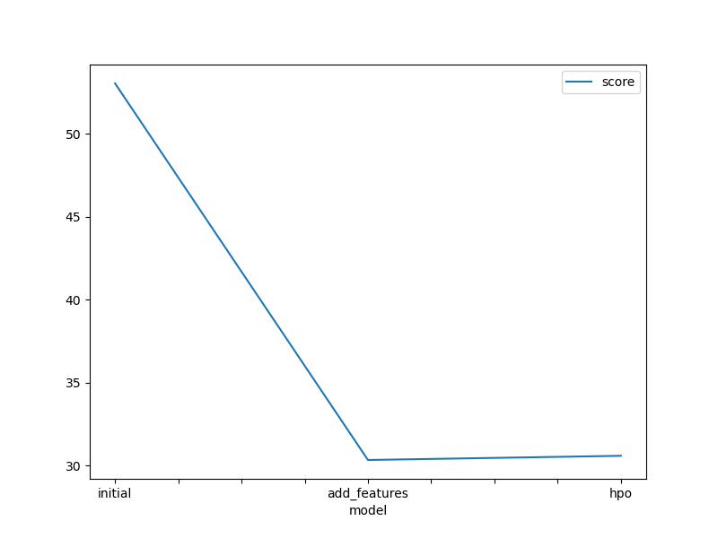
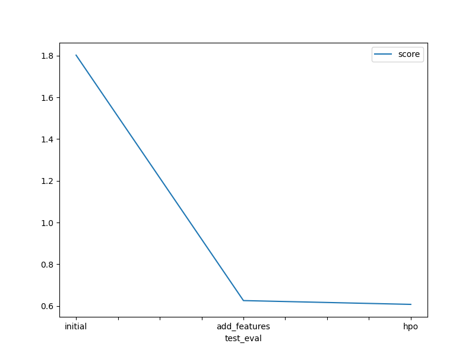

# Report: Predict Bike Sharing Demand with AutoGluon Solution
#### Yaw Opoku-Gyamerah

## Initial Training
### What did you realize when you tried to submit your predictions? What changes were needed to the output of the predictor to submit your results?
When I first ran predictor.predict(test), the raw predictions were counts (some even negative), but Kaggle expects non-negative integers for “count.” I had to clip all negative predictions to zero, and ensure my submission file’s count column matched the sample submission’s index order before saving to CSV.

### What was the top ranked model that performed?
The best model on validation data was the three-layer weighted ensemble, WeightedEnsemble_L3, with a validation RMSE of 53.031529

## Exploratory data analysis and feature creation
### What did the exploratory analysis find and how did you add additional features?
It showed strong daily and hourly patterns in rental counts. I extracted .dt.hour from the datetime column to add an hour feature, and converted season and weather to categorical types so the model wouldn’t treat them as continuous 

### How much better did your model preform after adding additional features and why do you think that is?
After adding the hour feature (plus categoricals), validation RMSE improved from 53.031529 to 30.348701 a ~43% reduction. Capturing the hourly demand cycle gave the model much more predictive power than relying on raw datetime integers alone.

## Hyper parameter tuning
### How much better did your model preform after trying different hyper parameters?
The validation RMSE edged down further from 30.348701 to 30.600835 for the final ensemble. The improvement was marginal (~0.8% on validation), suggesting diminishing returns under tight compute limits.

### If you were given more time with this dataset, where do you think you would spend more time?
I would explore more feature generation.

### Create a table with the models you ran, the hyperparameters modified, and the kaggle score.
|model|hpo1|hpo2|hpo3|score|
|--|--|--|--|--|
|initial|-|-|-|1.80203|
|add_features|-|-|-|0.62619|
|hpo|num_trials=3|scheduler=local|searcher=random|0.60799|

### Create a line plot showing the top model score for the three (or more) training runs during the project.

### Create a line plot showing the top kaggle score for the three (or more) prediction submissions during the project.

## Summary
In this project, AutoGluon’s stacked ensembles delivered strong performance out-of-the-box. Feature engineering (extracting hour and proper categorical types) yielded the largest gains, while limited HPO brought marginal additional improvements.
